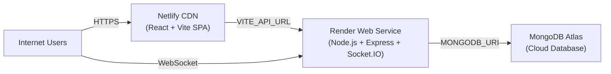

# Hospital Management System — Production Deployment Guide

Deploy the frontend on **Netlify**, the backend on **Render**, and the database on **MongoDB Atlas**.

## Production Architecture



| Component | Platform | URL pattern |
|-----------|----------|-------------|
| Frontend | Netlify | `https://your-app.netlify.app` |
| Backend API | Render | `https://hospital-api.onrender.com` |
| Database | MongoDB Atlas | `mongodb+srv://...` |

**Docker is optional** — only needed for local all-in-one development. Production uses Netlify + Render + Atlas directly.

---

## Prerequisites

- GitHub repository with this project
- [Netlify](https://netlify.com) account
- [Render](https://render.com) account
- [MongoDB Atlas](https://www.mongodb.com/atlas) account

---

## Step 1: MongoDB Atlas

1. Sign in to [MongoDB Atlas](https://cloud.mongodb.com).
2. Create a **free M0 cluster**.
3. **Database Access** → Add user with username/password (save credentials).
4. **Network Access** → Add IP `0.0.0.0/0` (allow from anywhere — required for Render).
5. **Database** → Connect → Drivers → copy connection string.
6. Replace `<password>` and set database name:

```
mongodb+srv://<username>:<password>@cluster0.xxxxx.mongodb.net/hospital-management?retryWrites=true&w=majority
```

7. Seed data (run once from your machine):

```bash
cd backend
cp .env.example .env
# Set MONGODB_URI to your Atlas connection string
npm run seed
```

---

## Step 2: Backend on Render

1. Push code to GitHub.
2. Render Dashboard → **New +** → **Web Service**.
3. Connect your repository.
4. Configure:

| Setting | Value |
|---------|-------|
| Root Directory | `backend` |
| Runtime | Node |
| Build Command | `npm install` |
| Start Command | `npm start` |
| Health Check Path | `/api/health` |

5. Add **Environment Variables**:

| Key | Value |
|-----|-------|
| `NODE_ENV` | `production` |
| `MONGODB_URI` | Your Atlas connection string |
| `JWT_SECRET` | Long random string (32+ chars) |
| `FRONTEND_URL` | `https://your-app.netlify.app` |

> `PORT` is set automatically by Render — do not override it.

6. Deploy and note your backend URL, e.g. `https://hospital-api.onrender.com`.

7. Verify:

```bash
curl https://hospital-api.onrender.com/api/health
```

Expected: `{"success":true,"message":"Hospital Management System API is running",...}`

---

## Step 3: Frontend on Netlify

1. Netlify Dashboard → **Add new site** → **Import from Git**.
2. Select your repository.
3. Configure build settings (or use `netlify.toml`):

| Setting | Value |
|---------|-------|
| Base directory | `hospital-management` |
| Build command | `npm run build` |
| Publish directory | `hospital-management/dist` |

4. Add **Environment Variable** (required — Vite bakes this in at build time):

| Key | Value |
|-----|-------|
| `VITE_API_URL` | `https://hospital-api.onrender.com` |

> No trailing slash. Must match your Render backend URL exactly.

5. Deploy the site.
6. Copy your Netlify URL, e.g. `https://your-app.netlify.app`.

7. **Update Render** `FRONTEND_URL` to your Netlify URL and redeploy the backend (CORS + Socket.IO).

---

## Step 4: Verify End-to-End

Test from any device (phone, tablet, another computer):

- [ ] Open `https://your-app.netlify.app/login`
- [ ] Login with seeded credentials
- [ ] Admin dashboard loads
- [ ] Appointments module works
- [ ] Patient registration/login works
- [ ] Real-time features connect (check browser console for socket connection)

### Default seeded accounts (after `npm run seed`)

Check `backend/seeder.js` for credentials. Common test account:

- Admin: `admin@hospital.com` / `admin123`

---

## Environment Variables Reference

### Frontend (`hospital-management/.env` or Netlify dashboard)

| Variable | Required | Description |
|----------|----------|-------------|
| `VITE_API_URL` | **Yes (production)** | Render backend URL |
| `VITE_DEV_API_URL` | No | Local Vite proxy target (default: `http://localhost:5001`) |

### Backend (`backend/.env` or Render dashboard)

| Variable | Required | Description |
|----------|----------|-------------|
| `PORT` | Auto on Render | Server port (5001 locally) |
| `MONGODB_URI` | **Yes** | Atlas or local MongoDB URI |
| `JWT_SECRET` | **Yes** | JWT signing secret |
| `NODE_ENV` | **Yes** | `development` or `production` |
| `FRONTEND_URL` | **Yes (production)** | Comma-separated Netlify URLs for CORS |

---

## Local Development

```bash
# Terminal 1 — Backend
cd backend
cp .env.example .env
npm install
npm run dev

# Terminal 2 — Frontend
cd hospital-management
npm install
npm run dev
```

Open `http://localhost:3000`. API calls proxy to `http://localhost:5001` via Vite.

### Test from phone on same WiFi

1. Find your computer IP: `ipconfig getifaddr en0` (Mac) or `ipconfig` (Windows).
2. Create `hospital-management/.env.local`:

```
VITE_API_URL=http://192.168.x.x:5001
```

3. Restart frontend dev server.
4. Open `http://192.168.x.x:3000` on your phone.

---

## Troubleshooting

| Problem | Cause | Fix |
|---------|-------|-----|
| Login works on laptop only | Frontend called `hostname:5001` | Set `VITE_API_URL` on Netlify |
| CORS error in browser | `FRONTEND_URL` mismatch | Set exact Netlify URL on Render |
| Network Error on login | Backend asleep (Render free tier) | Wait 30–60s for cold start, retry |
| MongoDB connection failed | Atlas IP whitelist | Add `0.0.0.0/0` in Network Access |
| 401 after login | JWT_SECRET changed | Clear localStorage, re-login |
| Socket won't connect | CORS or wrong URL | Match `FRONTEND_URL` and `VITE_API_URL` |

---

## Files Modified for Production

| File | Change |
|------|--------|
| `hospital-management/src/config/apiConfig.js` | Env-based API URL (removed localhost:5001 hack) |
| `hospital-management/src/services/api.js` | Error handling + 401 redirect |
| `hospital-management/src/utils/apiErrors.js` | User-friendly error messages |
| `hospital-management/vite.config.js` | Configurable dev proxy |
| `hospital-management/src/context/AuthContext.jsx` | Better errors + socket init |
| `backend/config/cors.js` | Production CORS |
| `backend/config/db.js` | Atlas connection options |
| `backend/server.js` | CORS + error handling |
| `backend/services/socketService.js` | Shared CORS config |
| `hospital-management/.env.example` | Frontend env template |
| `backend/.env.example` | Backend env template |
| `hospital-management/netlify.toml` | Netlify build config |
| `render.yaml` | Render blueprint |
